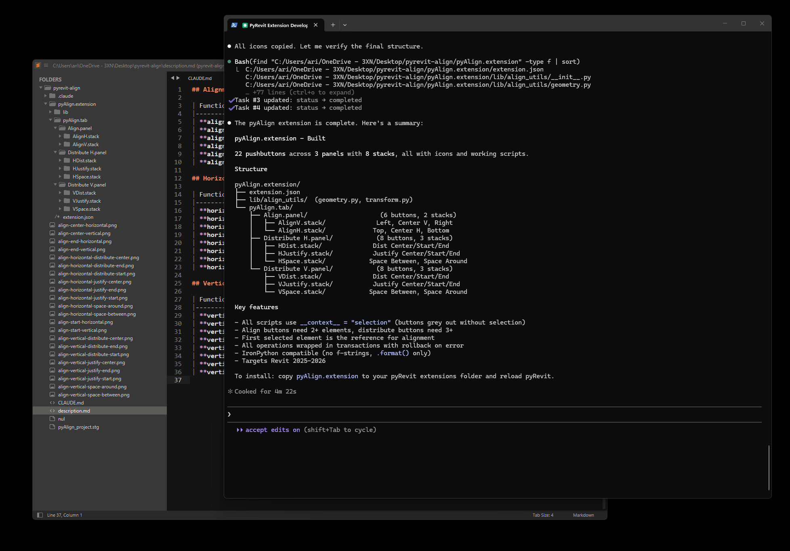

# pyAlign

Graphic-design style alignment tools for the Revit ribbon, built on [pyRevit](https://github.com/pyrevitlabs/pyRevit). Align, distribute, justify, and space Revit elements the way you would in Illustrator or Figma.



Works with model elements and annotations (text notes, tags, dimensions, detail items) in any 2D view. All tools operate on the current selection in the active view's coordinate system, so they behave the same in plans, sections, and elevations. Each command is a single undo step.

## Tools

### Align

Move elements to a shared edge or centerline.

| Tool | Behavior |
|------|----------|
| Left / Right | Align to the leftmost / rightmost edge |
| Top / Bottom | Align to the topmost / bottommost edge |
| Center V / Center H | Align to a shared vertical / horizontal centerline |

If one selected element is pinned, everything aligns to it instead of the outermost edge. If several are pinned, you pick one.

### Distribute

Even spacing, needs 3+ elements.

| Tool | Behavior |
|------|----------|
| Left / Right Edges | Equal spacing between left / right edges |
| Top / Bottom Edges | Equal spacing between top / bottom edges |
| Centers V / Centers H | Equal spacing between centerlines |

### Justify

Pack elements together with no gap.

| Tool | Behavior |
|------|----------|
| Pack Left / Right | Stack elements against the left / right edge |
| Pack Top / Bottom | Stack elements against the top / bottom edge |
| Pack Center V / H | Stack elements around the group's center |

### Space

Equalize gaps, needs 3+ elements.

| Tool | Behavior |
|------|----------|
| Between H / V | First and last stay put, gaps in between become equal |
| Around H / V | Equal space around each element, half-gaps at the edges |

Pinned elements are never moved. Align may use one as the reference.

## Installation

With the pyRevit CLI:

```
pyrevit extend ui pyAlign https://github.com/alrigithub/pyAlign.git
```

Or manually: clone this repo as a folder named `pyAlign.extension`, then add its parent folder in pyRevit > Settings > Custom Extension Directories and reload.

## Requirements

- Revit 2025-2026
- pyRevit 5.0+

## License

[MIT](LICENSE), Alex Ritivoi
